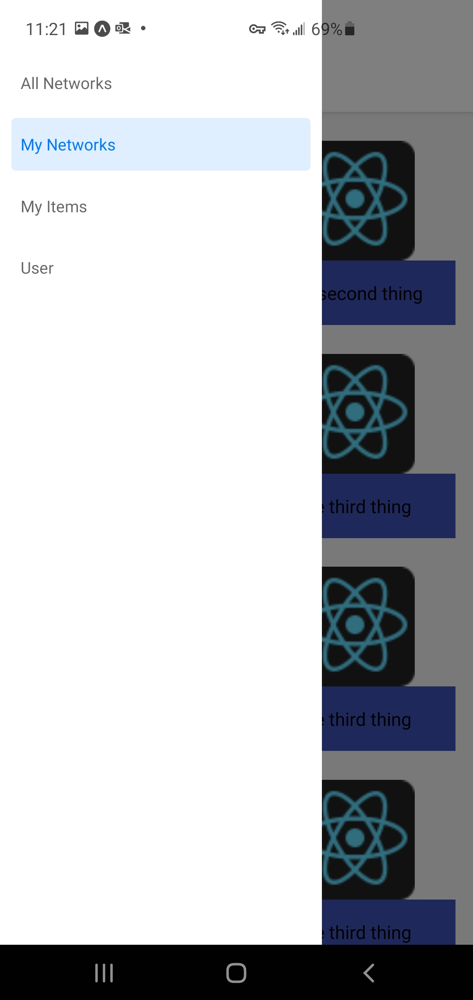
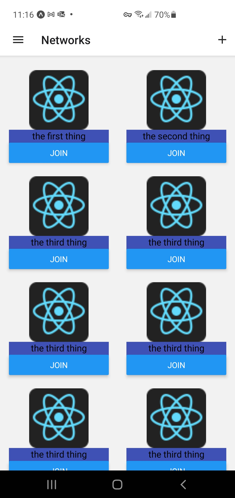
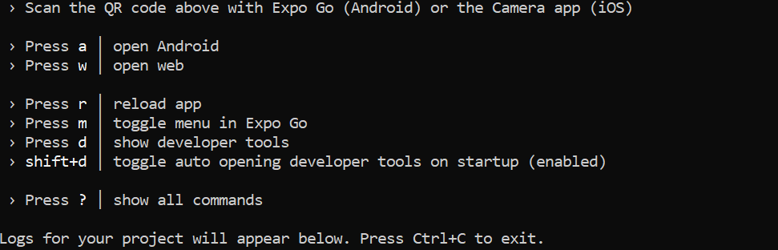
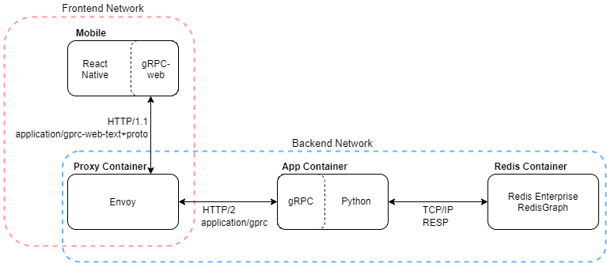
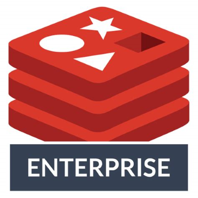
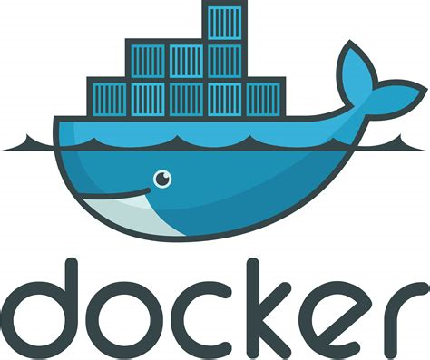
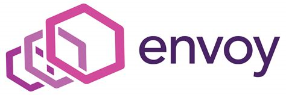

# The Network
## A 2021 Redis Hackathon Project

## Team:

<ul>
  <li> Rob Baxter </li>
  <li> Slattery Donohoe </li>
  <li> Jonas McGowan-Martin </li>
  <li> Jon Myers </li>
</ul>

## What is *The Network*?

*The Network* is a mobile application that enables you to build your own personal buying and selling network for whatever you like. When you meet people you want transact with, tell them to "join my network". Whether your an artist building a distribution network for your creations, or a group of sports fans coordinating ticket sales, *The Network* is a space that makes transacting easy.

## Use of Redis

This project uses RedisGraph to store and retrieve data. In the setup described below, Redis runs in a [redismod](https://github.com/RedisLabsModules/redismod) Docker container.

## How the data is stored

All data for *The Network* is stored in a graph. Users, networks, and items are nodes. Edges between nodes represent relationships. For example, an edge between two users indicates friendship. An edge between a user and an item indicates listing an items for sale. An edge between a user and a network indicates membership.

### Overview of Graph Structure:

**Nodes**:
- Users, Networks, Items, Tags

**Edges**:

|Node 1 |Node 2| Edges |
--- | --- | ---
|User |User | Friend|
|User | Item | Listing, Offer | 
|User | Network | Member |
|Item | Tags | Label |

TODO: Screenshot of a graph from RedisInsight

### Creating Users

When a person signs up for *The Network*, a **user** node is created. Properties are set on the node for user detail, such as email.

    GRAPH.QUERY THE_NETWORK_GRAPH "CREATE (:User {firstName: 'Elon', lastName: 'Musk', email: 'emusk@tesla.com'})"

### Creating Networks

When a user creates a network, a **netowrk** node is created and an **owner** edge is created between the user and the network.

    GRAPH.QUERY THE_NETWORK_GRAPH "CREATE (:Network {name: 'Red Sox Tickets', description: 'A network for exchanging Red Sox tickets.'})"

    // TODO: Need this query
    GRAPH.QUERY THE_NETWORK_GRAPH  "Match (p:User {email: 'emusk@tesla.com'} ) MATCH (n:Network {name:'Red Sox Tickets'}) CREATE (p)-[:MEMBER]->(n)"

When a network is created, the image associated with the network is stored in its own key. In the graph, the key is stored as a property on the network.

### Joining Networks

When a user joins a network, a **member** edge is created between the **user** node and the **network** node.

    GRAPH.QUERY THE_NETWORK_GRAPH  "Match (p:User {email: 'emusk@telsa.com'} ) MATCH (n:Network {name:'Red Sox Tickets'}) CREATE (p)-[:MEMBER]->(n)"

### Listing Items

When a user lists an item for sale in a network, an **item** node is created and a **selling** edge is created between the user and the item.

    // TODO: need query for creating the edge
    GRAPH.QUERY THE_NETWORK_GRAPH "CREATE (:Item {title: 'SOX v LAA Sat 5/15', description: '2 Seats. Awesome Loge Box', askingPrice: '$150', imageKey: 'image:46'})"

When an item is created, the image associated with the item is stored in its own key. In the graph, the key is stored as a property on the item.

    SET image:46 ajsdkjashdkjhaskdjhasd

TODO: Command Details

// TODO: add tags description and code

### Making an Offer

When a user makes an offer for a listed item, an **offer** edge is created between the user and the item. The edge has a property for offer status which could be one of the following: `active`, `accepted`, `rejected`. When an **offer** edge is created, the **status** property is initialized to `active`. In the event that an offer is made on a item already having an `accepted` offer, the offer is initialized to `rejected`.

TODO: Command Details

### Accepting an Offer

When a user accepts an offer on a listed item, the **status** property on the **offer** edge updates to `accepted`. All other offers with a status property of `active` are updated to `rejected`.

TODO: Command Details

### Rejecting an Offer

When a user rejects an offer on a listed item, the **status** property on the **offer** edge updates to `rejected`.

TODO: Command Details

## How the Data is Accessed

### Find All Listed Items in Any Network a User is a Member

The My Home screen shows the user all items for sale in all networks the user is a member. The following query finds all items for the My Home screen.

TODO: Command Details

### Find a User's Listed Items

The *My Items* screen shows all items a user has for sale. The following query finds all items for the *My Items* screen.

TODO: Command Details

### Find All Offers for an Item

TODO: Command Details

#### All Item Tags that a User Has Made Offers on (Analytics)

// Show the image from redisinsight

#### 

## Utility & Usefulness

## UX and DX
The following table shows iPohone and Android screenshots for each page in the mobile application. 

|Page |iPhone | Android|
--- | --- | --- 
|Main Menu|||
|Explore Networks|||
|My Networks|||
|My Listings|||

## Installation Instructions

### Prerequisites:

- Must have Docker ([Windows](https://docs.docker.com/docker-for-windows/install/) |  [Ubuntu](https://docs.docker.com/engine/install/ubuntu/))

- Must have [Node 14+](https://nodejs.org/en/download/)

- Must have [Expo](https://docs.expo.io/) 

After installing Node, install Expo:
    
    npm i -g expo-cli

### Local Install

Get the repo:

    git clone https://github.com/rbaxter1/redis-hackathon-2021.git

    cd redis-hackathon-2021

Build and start the containers for Redis, RedisInsight, the backend Python gRPC server, and the Envoy proxy:

    docker compose up -d

Run the mobile application using Expo in a local web browser. This application can be run on your mobile phone by installing [Expo Go](https://expo.io/client). However, we recommend starting with the web browser since you may encounter into connectivity issues that require custom configuration, depending on your local network setup.

    cd mobile/src

    npm i

	expo start
	
After running `expo start`, you are presented with the following options:

 In the command window, type `w` to open the mobile application in your default web browser.

> **Tip**: When running in the browser, you can to see debugger output from the React Native app by opening your browser's developer tools window ([Firefox](https://developer.mozilla.org/en-US/docs/Tools) | [Chrome](https://developer.chrome.com/docs/devtools/open/))

## Architecture:

The following diagram illustrates the architecture.

 

## Technology Stack

- [Redis](https://redis.io/) powers the persistence layer. Using the [RedisGraph](https://oss.redislabs.com/redisgraph/) available from [Redis Labs](https://redislabs.com/) and provides fast, sophisticated graph operations making data management and querying easy.

- The back-end server is written in [Python](https://www.python.org/). Redis is accessed though the [redis-py module](https://docs.redislabs.com/latest/rs/references/client_references/client_python/). We also use the [redisgraph-py module](https://github.com/RedisGraph/redisgraph-py).

- All backend components are deployed to [Docker](https://www.docker.com/) containers. You can easily launch the entire back-end with a simple `docker compose up` command.

- We use [gRPC](https://grpc.io/) for transport ([HTTP/2](https://http2.github.io/)), serialization ([ProtocolBuffers](https://developers.google.com/protocol-buffers/)), and service endpoint definitions.

- The mobile front-end is built on [React Native](https://reactnative.dev/) which conveniently allows a developer to create both iOS and Android application with a single codebase.

- Using [Expo](https://docs.expo.io/) developers can create an app with a single `expo init` command and debug either in a web browser or on a mobile device.

- [grpc-web](https://github.com/grpc/grpc-web) enables gRPC interface definitions to be compiled into native Javascript.

- We use [Envoy](https://www.envoyproxy.io/) for the proxy layer between the front-end mobile app and the back-end services. Envoy has a built-in `grpc_web` filter to convert HTTP/1.1 traffic to HTTP/2.

| | | |
--- | --- | ---
| | |  |
| |  |  |

## Developer Notes:

To generate the native Javascript and Python classes and RPC endpoints from the gRPC proto file, execute the following commands.

python:

    python -m grpc_tools.protoc -I./proto --python_out=. --grpc_python_out=. ./proto/network.proto

grpc-web (javascript):

    protoc -I=./proto ./proto/network.proto --js_out=import_style=commonjs:. --grpc-web_out=import_style=commonjs,mode=grpcwebtext:.
