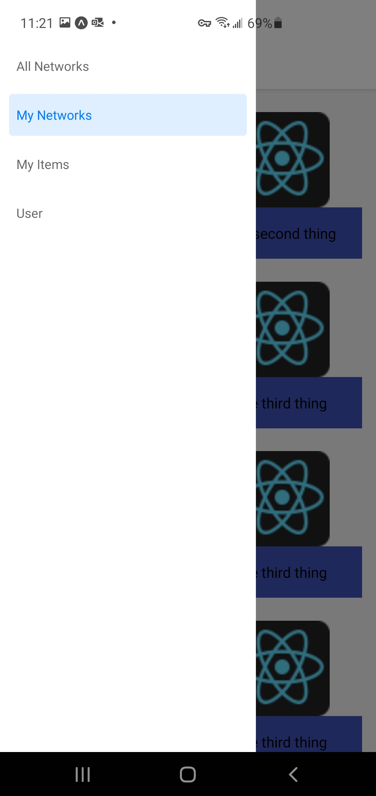
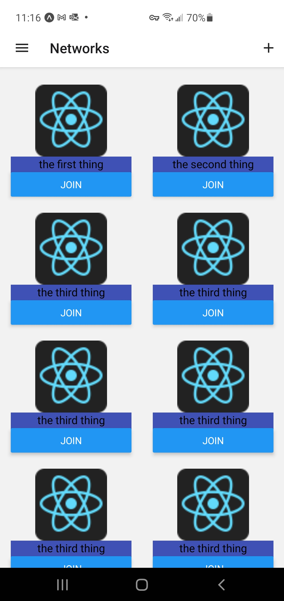
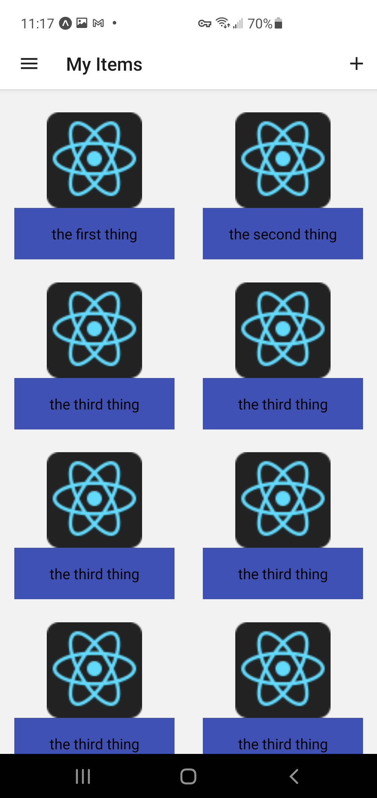

# The Network
## A 2021 Redis Hackathon Project

## Team:

<ul>
  <li> Rob Baxter </li>
  <li> Slattery Donohoe </li>
  <li> Jonas McGowan-Martin </li>
  <li> Jon Myers </li>
</ul>

## Use of Redis

### How the data is stored

All data for The Network is stored in a graph. Users, Networks, and Items are nodes. Edges between nodes represent relationships. For example, an edge between two users can indicate friendship. An edge between a user and an item can indicate listing an items for sale. An edge between a user and a network can indicate membership.

#### Overview of graph structure:

Nodes:
- Users, Networks, Items

Edges:
- User-User - friend | transaction
- User-Item - listing | transaction | viewed
- User-Network - membership

TODO: Screenshot of a graph from RedisInsight

#### Creating Users
Startup screen
When a person signs up for The Network, a node is created for that user. Properties are set on the node for user detail, such as email.

    GRAPH.QUERY THE_NETWORK_GRAPH "CREATE (:User {firstName: 'Elon', lastName: 'Musk', email: 'emusk@tesla.com'})"

#### Creating Networks
add image
When a user creates a network, a node is created for the network and an owner edge is created between the user and the network.

    GRAPH.QUERY THE_NETWORK_GRAPH "CREATE (:Network {name: 'Red Sox Tickets', description: 'A network for exchanging Red Sox tickets.'})"

    // TODO: Need this query
    GRAPH.QUERY THE_NETWORK_GRAPH  "Match (p:User {email: 'emusk@tesla.com'} ) MATCH (n:Network {name:'Red Sox Tickets'}) CREATE (p)-[:MEMBER]->(n)"

#### Joining Networks
adding is_member to get networks
When a user joins a network, a member edge is created between the user and the network.

    GRAPH.QUERY THE_NETWORK_GRAPH  "Match (p:User {email: 'emusk@telsa.com'} ) MATCH (n:Network {name:'Red Sox Tickets'}) CREATE (p)-[:MEMBER]->(n)"

#### Listing Items

When a user lists an item for sale in a network, a node is created for the item and a `selling` edge is created between the user and the item.

    // TODO: need query for creating the edge
    GRAPH.QUERY THE_NETWORK_GRAPH "CREATE (:Item {title: 'SOX v LAA Sat 5/15', description: '2 Seats. Awesome Loge Box', askingPrice: '$150', imageKey: 'image:46'})"

When an item is created, the image associated with the item is stored its own key. In the graph, the key is stored as a property on the item.

    SET image:46 ajsdkjashdkjhaskdjhasd

TODO: Command Details

// TODO: add tags description and code

#### Making an Offer

When a user makes an offer for a listed item, an offer edge is created between the user and the item. The edge has a property for offer status which could be one of the following: `active`, `accepted`, `rejected`

TODO: Command Details

#### Accepting an Offer
My Offers Drawer

When a user accepts an offer on a listed item, an edge is created between the user who made the offer and the item. An edge is also created between the two users indicating they have transacted.

TODO: Command Details

#### Rejecting an Offer

TODO: Command Details

### How the data is accessed

#### Find Items for Sale in All a User's Networks

The My Home screen shows the user all items for sale in all networks the user is a member. The following query finds all items for the My Home screen.

TODO: Command Details

#### Get All Offers for an Item (Manage Offers)

TODO: Command Details

#### All Item Tags that a User Has Made Offers on (Analytics)

// Show the image from redisinsight

#### 

## Utility & Usefulness

## UX and DX

|Page |iPhone | Android|
--- | --- | --- 
|Main Menu|||
|Networks|||
|My Listed Items|||

## Installation Instructions

### Prerequisites:

- Must have Docker ([Windows](https://docs.docker.com/docker-for-windows/install/) |  [Ubuntu](https://docs.docker.com/engine/install/ubuntu/))

- Must have [Node 14+](https://nodejs.org/en/download/)

- Must have [Expo](https://docs.expo.io/) 

After installing Node, install Expo:
    
    npm i -g expo-cli

### Local Install

Get the repo:

    git clone https://github.com/rbaxter1/redis-hackathon-2021.git

    cd redis-hackathon-2021

Build and start the containers for Redis, RedisInsight, the backend Python gRPC server, and the Envoy proxy:

    docker compose up -d

Run the mobile application using Expo in a local web browser. This application can be run on your mobile phone by installing [Expo Go](https://expo.io/client). However, we recommend starting with the web browser since you may encounter into connectivity issues that require custom configuration, depending on your local network setup.

    cd mobile/src

    npm i

	expo start
	
After running `expo start`, you are presented with the following options:

 In the command window, type `w` to open the mobile application in your default web browser.

> **Tip**: When running in the browser, you can to see debugger output from the React Native app by opening your browser's developer tools window ([Firefox](https://developer.mozilla.org/en-US/docs/Tools) | [Chrome](https://developer.chrome.com/docs/devtools/open/))

## Architecture:

## THESE ARE JUST NOTES TODO REMOVE

Required:

    docker pull redislabs/redismod
    docker pull envoyproxy/envoy-dev:0cdd980286615044b66ee585d56fedd71631c9df

Start:
    docker compose up --build -d

Notes: 

from grpc dir:

    // to generate python
    python -m grpc_tools.protoc -I./proto --python_out=. --grpc_python_out=. ./proto/network.proto

    // to generate grpc-web
    protoc -I=./proto ./proto/network.proto --js_out=import_style=commonjs:. --grpc-web_out=import_style=commonjs,mode=grpcwebtext:.

    

    

At this point, if you have expo installed on your mobile device, you can open it and scan the QR code. You may need to change the connection type to Tunnel. If you do not have expo installed on your Android or iPhone, then simply type w to launch the app in your browser.

client.py
Generate a network
Users - 20 (some cross users)
Networks - 4 
Items per Network - randomly select thumbnail... 20+ Items

Nice to have list:
Invite People to a network
Search user
Privacy

