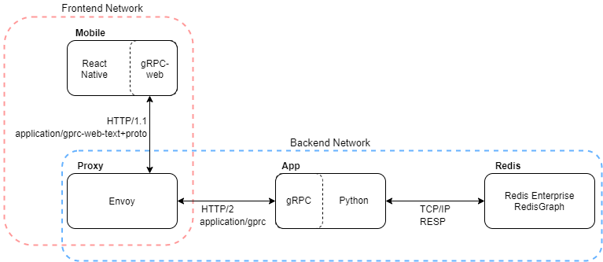

# The Network
## A 2021 Redis Hackathon Project

## Team:

<ul>
  <li> Rob Baxter </li>
  <li> Slattery Donohoe </li>
  <li> Jonas McGowan-Martin </li>
  <li> Jon Myers </li>
</ul>

## Use of Redis

### How the data is stored

### How the data is accessed

## Utility & Usefulness

## UX and DX

TODO: screenshot

## Installation

### Prerequisites:

- Must have Docker ([Windows](https://docs.docker.com/docker-for-windows/install/) |  [Ubuntu](https://docs.docker.com/engine/install/ubuntu/))

- Must have [Node 14+](https://nodejs.org/en/download/)

- Must have [Expo](https://docs.expo.io/) 

After installing Node, install Expo:
    
    npm i -g expo-cli

### Local Install

Get the repo:

    git clone https://github.com/rbaxter1/redis-hackathon-2021.git

    cd redis-hackathon-2021

Build and start the containers for Redis, RedisInsight, the backend Python gRPC server, and the Envoy proxy:

    docker compose up -d

Run the mobile application using Expo in a local web browser. This application can be run on your mobile phone by installing [Expo Go](https://expo.io/client). However, we recommend starting with the web browser since you may encounter into connectivity issues that require custom configuration, depending on your local network setup.

    cd mobile/src

    npm i

	expo start
	
After running `expo start` you will be presented with the following choices:

 In the command window type `w` to open the mobile application in your default web browser.

> **Tip**: When running in the browser, you can to see debugger output from the React Native app by opening your browser's developer tools window ([Firefox](https://developer.mozilla.org/en-US/docs/Tools) | [Chrome](https://developer.chrome.com/docs/devtools/open/))

## Architecture:

## THESE ARE JUST NOTES TODO REMOVE

Required:

    docker pull redislabs/redismod
    docker pull envoyproxy/envoy-dev:0cdd980286615044b66ee585d56fedd71631c9df

Start:
    docker compose up --build -d

Notes: 

from grpc dir:

    protoc -I=./proto ./proto/network.proto --js_out=import_style=commonjs:. --grpc-web_out=import_style=commonjs,mode=grpcwebtext:.

    python -m grpc_tools.protoc -I./proto --python_out=. --grpc_python_out=. ./proto/network.proto

    

At this point, if you have expo installed on your mobile device, you can open it and scan the QR code. You may need to change the connection type to Tunnel. If you do not have expo installed on your Android or iPhone, then simply type w to launch the app in your browser.